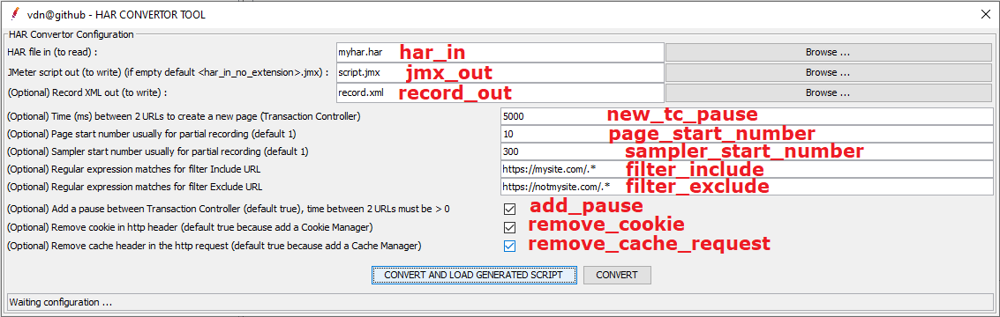
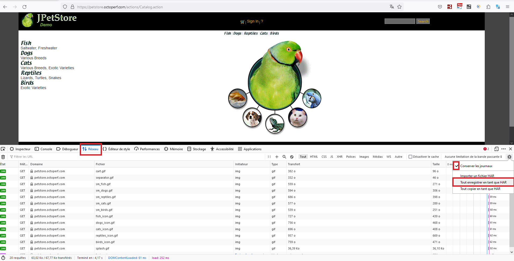
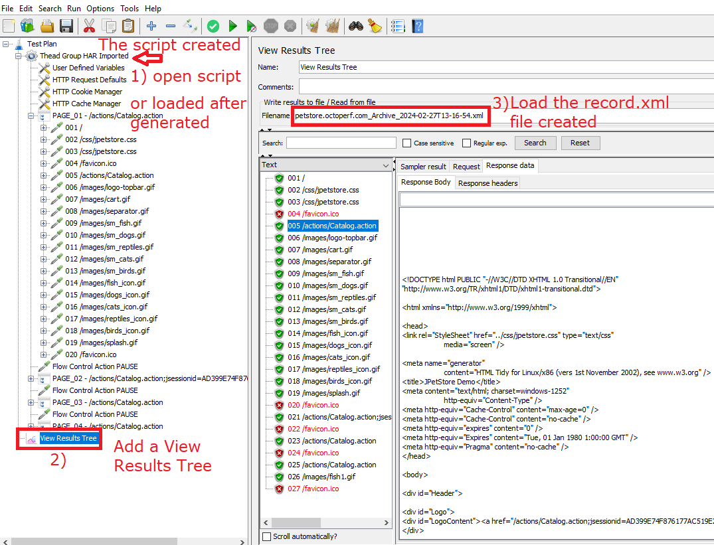

# Article en français pour le site https://www.developpez.com/

## Motivation pour la création d'un outil de conversion d'un fichier HAR en script JMeter et Record.xml

L’enregistrement d’un script JMeter via la méthode classique d’utilisation d’un template « Recording » demande plusieurs opérations et nécessite des droits assez élevés sur la machine.

Il faut notamment déclarer pour les sites en https le certificat temporaire de JMeter généré au lancement de l’enregistrement dans le navigateur (avec Firefox) ou dans Windows car en https l'enregistreur JMeter se comporte en "man in the middle" avec une connexion https entre le navigateur et JMeter et une autre connexion en https entre JMeter et l'application. Ainsi JMeter peut écouter les échanges.

Il faut ensuite modifier les paramètres de proxy du navigateur afin de passer par le proxy d’enregistrement de JMeter « HTTP(S) Test Script Recorder ».

Dans certains cas, en particulier sur les PCs des clients, les paramètres réseaux des navigateurs sont protégés par des règles de sécurité et on ne peut pas changer les paramètres du proxy du navigateur. 

Une solution pratique est d’utiliser un Firefox Portable (un simple zip à dézipper) qui n’a pas besoin de droits importants pour s’installer mais qui peut quand même être interdit pas la politique de sécurité du client et certaines applications web peuvent ne pas bien fonctionner avec Firefox car elles ont été développées uniquement avec Edge ou Chrome.

Une autre raison de cet outil est qu'Apache JMeter ne supporte pas l'enregistrement de le "HTTP(S) Test Script Recorder" des échanges utilisant le protocole websocket (ws et wss) et il se bloque.

Une solution alternative est de récupérer les échanges réseaux au niveau de navigateur et d’enregistrer ces échanges dans un format standard HAR (Http ARchive) puis d’utiliser un outil qui va lire les échanges du fichier HAR pour générer un script JMeter et aussi un fichier Record.xml avec un résultat proche de l’enregistrement « classique ». Cette solution n'a pas besoin de droits élevés sur le PC pour fonctionner.

L’avantage est que le format HAR est commun aux navigateurs.

## Création d'un fichier HAR dans un navigateur
La création d’un fichier HAR dans un navigateur est assez semblable selon le navigateur (Firefox, Chrome ou Edge).

### Dans Firefox
Firefox garde le contenu des échanges en particulier le contenu des fichiers uploadés.

Pour Firefox : 
1)	Ouvrir les dev tools en tapant &lt;F12&gt;
2)	Onglet "Réseau"
3)	Activer "Conserver les journaux"
4)	Si besoin effacer les échanges avant de naviguer
5)	Naviguer dans l’application pour générer les échanges réseaux (attendre quelques secondes entre les pages afin de regrouper les échanges par la suite)
5)	Sauvegarder les échanges au format HAR

### Dans Chrome
On note que Chrome ne garde pas le contenu des échanges en upload des fichiers et le HAR est souvent plus petit que celui enregistré avec Firefox.

Pour Chrome : 
1)	Ouvrir les dev tools en tapant &lt;F12&gt;
2)	Onglet "Network"
3)	Le bouton Record est actif. 
4)  Il faut cocher "Preserve log"
5)	Si besoin effacer les échanges avant de naviguer
6)	Naviguer dans l’application pour générer les échanges réseaux (attendre quelques secondes entre les pages afin de regrouper les échanges par la suite)
7)	Sauvegarder les échanges au format HAR avec "Export HAR ..."

## L'outil har-convertor-jmeter-plugin

### Installation du plugin dans JMeter
La solution recommandée pour installer le plugin est d'utiliser le gestionnaire de plugins du site https://jmeter-plugins.org

Le nom du plugin est « vdn@github - har-convertor-jmeter-tool »

L’outil est également livré avec 2 script shell (1 pour Windows et 1 pour Linux) pour lancer en CLI l’outil de conversion.

Une 2ème solution est de télécharger l'outil dans sa dernière version qui est dans la partie Release du projet GitHub : https://github.com/vdaburon/har-convertor-jmeter-plugin/releases  
et placer le fichier jar har-convertor-jmeter-plugin-&lt;version&gt;-jar-with-dependencies.jar dans le répertoire &lt;JMETER_HOME&gt;/lib/ext

### Utilisation du plugin dans JMeter
Le principe de conversion de l'outil est schématiquement le suivant :
1) Création du fichier HAR
2) Lancement de l'outil de conversion
3) Le script JMeter .jmx est créé
4) Le fichier des échanges record.xml est créé

Le plugin fait partie des outils qui se trouvent dans le menu "Tools" de l'interface JMeter

L'interface de l'outil de conversion et les paramètres :

#### Les paramètres
Les paramètres sont :
* har_in le fichier HAR à lire (exporté au préalable au format HAR des navigateurs :  Chrome, Firefox, Edge ...)
* jmx_out le script JMeter généré, si le champ est vide alors le nom du fichier sera le fichier har_in sans extension avec le préfixe ".jmx"  
  Ex : har_in = myhar1.har, jmx_out est vide alors file_out sera myhar1.jmx
* record_out création du fichier record xml à partir des échanges du fichier har (Ce fichier XML s'ouvre dans un  "Listener View Results Tree")  
  Ex : record_out = record.xml
* new_tc_pause le temps entre 2 urls pour créer une nouvelle page (Transaction Controller) (par défaut 5000 = jmeter property valeur : proxy.pause=5000)  
    * e.g. 5000 pour 5 sec entre 2 urls
* page_start_number, permet d'indiquer le numéro de la 1ère page, utile quand on fait un enregistrement partiel de la navigation (par défaut 1, entier > 0)  
* sampler_start_number, permet d'indiquer le numéro de départ des samplers, utile pour un enregistrement partiel (par défaut 1, entier > 0)  
* filter_include,  une expression régulière qui filtrer en inclusion les urls  
    * par défaut toutes les urls = vide (pas de filtre)
    * Ex : filter_include=https://mysite.com/.*
* filter_exclude,  une expression régulière qui filtrer en exclusion les urls  
    * par défaut toutes les urls = vide (pas de filtre)
    * Ex : filter_exclude=https://notmysite.com/.*
    * pour filtrer les éléments statiques, filter_exclude=(?i).*\\.(bmp|css|js|gif|ico|jpe?g|png|swf|eot|otf|ttf|mp4|woff|woff2)
* add_pause checkbox, ajoute un Flow Control Action Pause (défaut true)  
* remove_cookie checkbox , retire le header avec un cookie car il y a un Cookie Manager dans le script (défaut true)  
* remove_cache_request checkbox, retire l'information du cache request header car il y a un Cache Manager dans le script (défaut true)  

Status, la line status contient le résultat de l'outil.

Ex : Status Results **OK**
* Tool HAR Convertor Finished OK, fileJmxOut=C:\Temp\script1.jmx
* Tool HAR Convertor Finished OK, fileJmxOut=C:\Temp\script1.jmx AND recordXmlOut=C:\Temp\record.xml

Ex : Status Results **KO**
* Tool HAR Convertor Finished KO, CAN'T READ HAR fileHarIn = C:\Temp\harzzzz.har
* Tool HAR Convertor Finished KO, exception = java.util.regex.PatternSyntaxException: Unmatched closing ')' near index 2  (.))
* Tool HAR Convertor Finished KO, exception = net.sf.saxon.trans.XPathException: Failed to create output file file:/c:/toto.jmx

#### Les boutons d'action
* "CONVERT AND LOAD GENERATED SCRIPT", génère le script JMeter the JMeter script et le fichier record.xml si non vide, ensuite si pas d'erreur charge le script généré dans JMeter.
* "CONVERT", génère le script JMeter the JMeter script et le fichier record.xml si non vide.

## Comparaison de l'enregistrement "classique" avec le template d'enregistrement et l'outil de conversion

### Enregistrement d'un script avec le Template et HTTP(S) Test Script Recorder  - La façon standard
Le template d'enregistrement JMeter Recording :  

Le résultat de l'enregistrement avec "HTTP(S) Test Script Recorder" :  

### HAR créé dans un navigateur (e.g. Firefox) - la nouvelle façon avec  l'outil de conversion
Enregistrement de la navigation dans un navigateur avec les "Developer tools" : **Network** and **save** exchanges in **HAR** file format :  

Lancement de la conversion avec "Convertor tool" :  

Le résultat : le script généré et le fichier record.xml dans un "View Results Tree"  

## Comparaison de l'outil har-convertor-jmeter-plugin avec les autres solutions de conversion

### Blazemeter converter
Une solution assez ancienne connue pour faire une conversion d'un fichier HAR vers un script JMeter est celle de blazemeter : https://converter.blazemeter.com/

Le résultat en sortie de la conversion de Blazemeter par rapport à l'outil har-convertor-jmeter-plugin

La conversion est un script JMeter, toutefois :
- Pas de découpage en page (si délai de n secondes entre les urls)
- Pas de pause entre les pages mais des timers (Uniform Random Timer) sous chaque request
- Pas de Http Default avec le nom du host + scheme + port en dur sur tous les http samplers
- Pas de filtre en include ou exclude des urls
- Pas de numérotation des url (en préfix)
- Pas de fichier record.xml, ce fichier est important pour faire les futures correlations
- Limitation à 50 Mo du fichier HAR
- Des données sensibles peuvent être transmises au site blazemeter contenues dans le fichier HAR

### Plugin HAR (HTTP Archive) Import de Qytera-Gmbh
Un autre plugin pour JMeter nommé : "HAR (HTTP Archive) Import" se trouve également dans le menu "Tools" de JMeter

La conversion est un script JMeter mais :
- Pas de découpage en page (si délai de n secondes entre les urls)
- Pas de pause entre les pages mais des timers (Constant Timer) sous chaque request
- Pas de Http Default avec le nom du host + scheme + port en dur sur tous les http samplers
- Pas de filtre en include ou exclude des urls
- Pas de numérotation des url (en préfix)
- Pas de fichier record.xml, ce fichier est important pour faire les futures correlations

## Versions

Version 1.0 du README en français.

