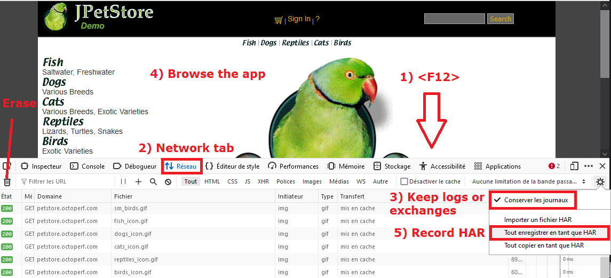
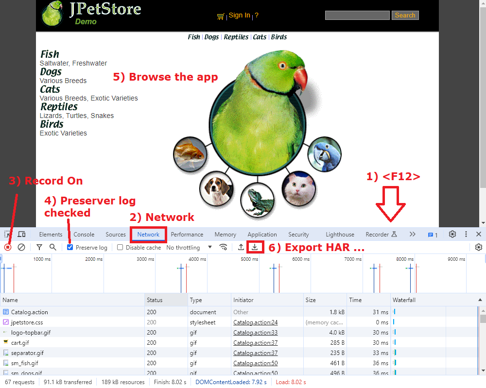
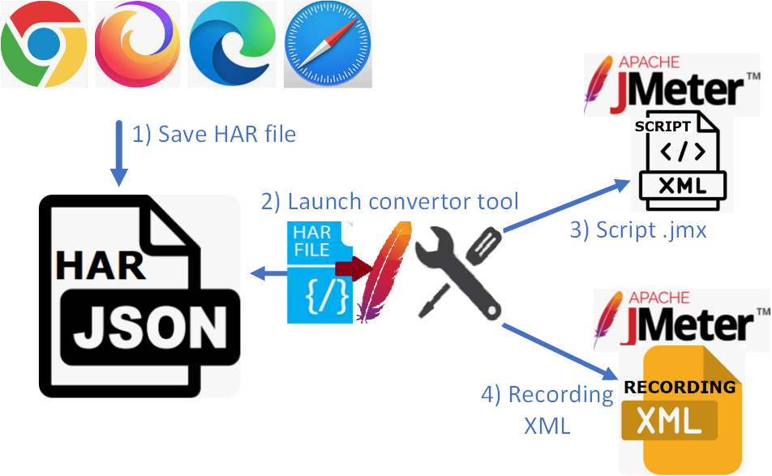
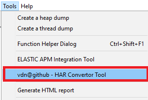
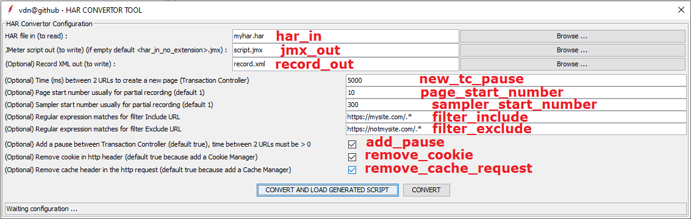
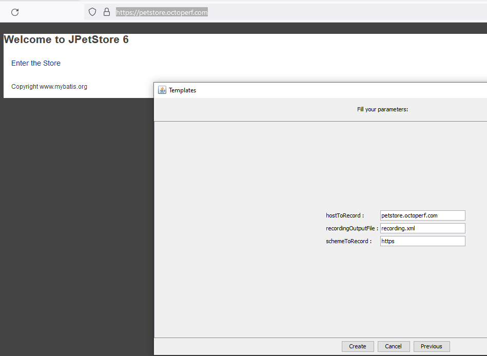
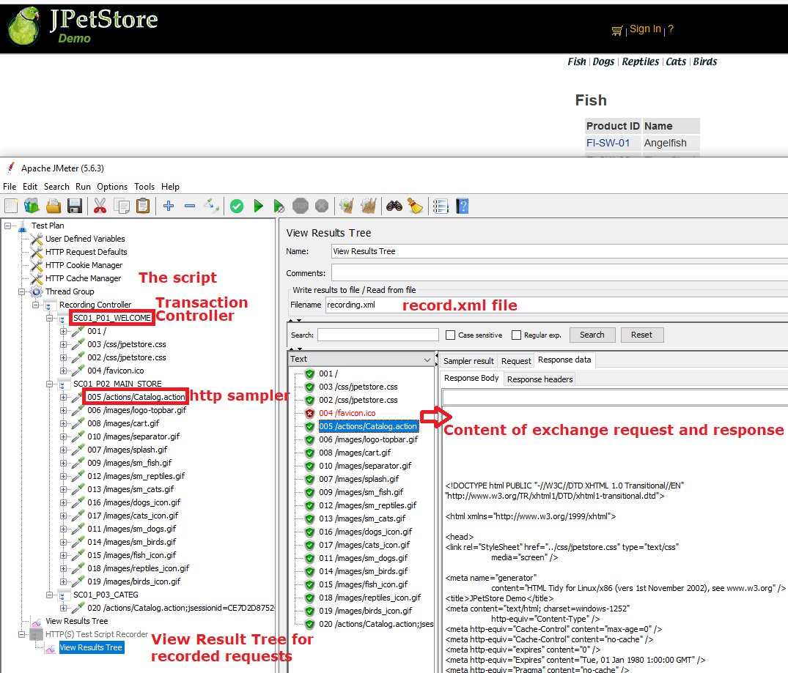
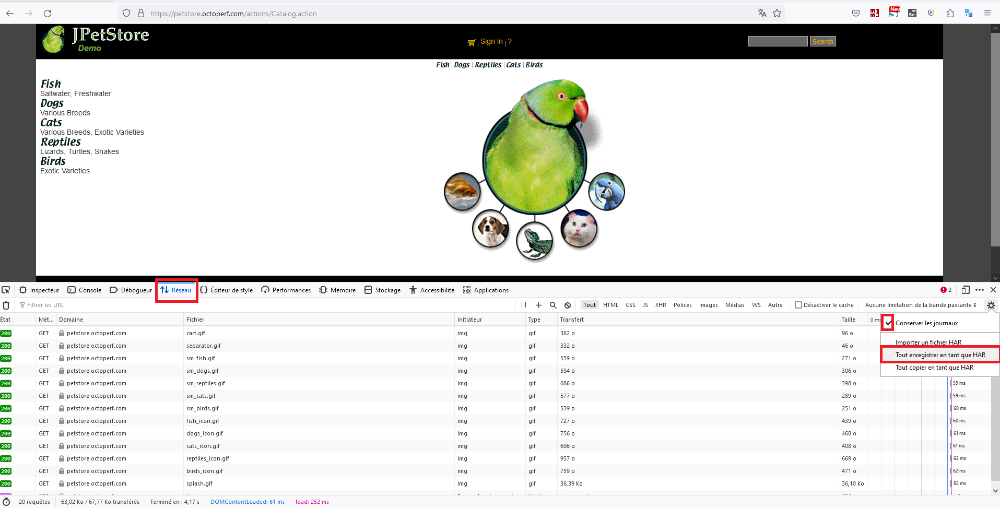
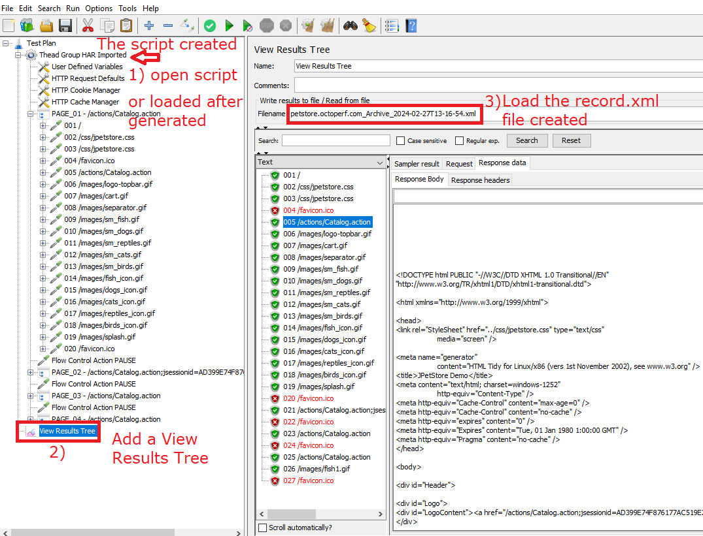

# Article en français pour le site https://dzone.com/

## Motivation for creating a tool for converting a HAR file into JMeter and Record.xml script

Recording a JMeter script via the classic method of using a "Recording template" requires several operations and requires high administrator rights on the machine.

In particular, it's necessary to declare for https sites the temporary JMeter certificate generated when starting the recording in the browser (with Firefox) or in Windows because in https protocol JMeter recorder behaves like a "man in the middle" with one connection https between the browser and JMeter and another https connection between JMeter and the application. So JMeter can listen to the exchanges.

You must then modify the browser proxy settings in order to use the JMeter recording proxy “HTTP(S) Test Script Recorder”.

In some cases, particularly on client PCs, browser network settings are protected by security policies and you cannot change browser proxy settings.

A useful solution is to use Firefox Portable (a simple zip to unzip) which does not need significant rights to install but which may still be prohibited by the client's security policy and certain web applications may not work well with Firefox because they developed only for Edge or Chrome.

Another reason for this tool is that Apache JMeter does not support the recording of the "HTTP(S) Test Script Recorder" of exchanges using the websocket protocol (ws and wss) and it crashes.

An alternative solution is to retrieve network exchanges at the browser level and save these exchanges in a standard HAR format (Http ARchive) then use a tool which will read the exchanges from the HAR file to generate a JMeter script and also a Record.xml file with a result close to the “classic” recording. This solution does not need elevated rights on the PC to work.

The advantage is that the HAR format is common to browsers.

## Creating a HAR file in a browser
Creating a HAR file in a browser is quite similar depending on the browser (Firefox, Chrome or Edge).

### For Firefox
Firefox keeps the content of exchanges, in particular the content of uploaded files.

In Firefox :
1)	Open dev tools with &lt;F12&gt;
2)	Tab "Network"
3)	Check Keep Activer "Keep logs or Exchanges".
Optional) If need, delete the exchanges before browsing
5)	Navigate the application to generate network exchanges (wait a few seconds between pages in order to group the exchanges afterwards)
5)	Save exchanges in HAR format

### For Chrome
We note that Chrome does not keep the content of exchanges when uploading files and the HAR is often smaller than that recorded with Firefox.

In Chrome :
1)	Open dev tools with &lt;F12&gt;
2)	Tab "Network"
3)	Record button is ON.
4)  "Preserve log" is checkeda.
    Optional) If need, delete the exchanges before browsing
5)	Navigate the application to generate network exchanges (wait a few seconds between pages in order to group the exchanges afterwards)
6)	Save exchanges in HAR format "Export HAR ..."

## har-convertor-jmeter-plugin  tool

### Installing the plugin in JMeter
The recommended solution to install the plugin is to use the plugin manager of the site https://jmeter-plugins.org

The plugin name is « vdn@github - har-convertor-jmeter-tool »

The tool also comes with 2 shell scripts (1 for Windows and 1 for Linux) to launch the conversion tool in CLI.

A 2nd solution is to download the tool in its latest version find in the Release part of the GitHub project: https://github.com/vdaburon/har-convertor-jmeter-plugin/releases  
and place the har-convertor-jmeter-plugin-&lt;version&gt;-jar-with-dependencies.jar jar file in the &lt;JMETER_HOME&gt;/lib/ext directory

### Using the plugin in JMeter
The steps of conversion of the tool are schematically as follows:
1) Create the HAR
2) Launch the conversion tool
3) The JMeter script .jmx is created
4) The record.xml exchange file is created

The plugin is one of the tools found in the “Tools” menu of the JMeter interface

Tool interface and settings:

#### Parameters
Parameters are :
* har_in the HAR file to read (exported HAR from Web Browser :  Chrome, Firefox, Edge ...)
* jmx_out the file JMeter script generated, if the text field is empty then the jmx_out is the file name of har_in without the extension with suffix ".jmx"  
  e.g. har_in = myhar1.har, jmx_out is empty then file_out will be myhar1.jmx
* record_out create the record xml file from the har file (could be open with the Listener View Results Tree)  
  e.g. record_out = record.xml
* new_tc_pause time between 2 urls to create a new page (Transaction Controller) (default 5000 = jmeter property value : proxy.pause=5000)  
  * e.g. 5000 for 5 sec between 2 urls
* page_start_number, set the start page number for partial recording (default 1, must be an integer > 0)  
* sampler_start_number, set the start sampler number for partial recording (default 1, must be an integer > 0)  
* filter_include,  the regular expression matches the URL to Include  
  * default all = empty (no filter)
  * e.g. filter_include=https://mysite.com/.*
* filter_exclude,  the regular expression matches the URL to Exclude  
  * default all = empty (no filter)
  * e.g. filter_exclude=https://notmysite.com/.*
  * or filter statics, filter_exclude=(?i).*\\.(bmp|css|js|gif|ico|jpe?g|png|swf|eot|otf|ttf|mp4|woff|woff2)
* add_pause checkbox, add Flow Control Action Pause, parameter new_tc_pause must be > 0 (default true)  
* remove_cookie checkbox , remove header with cookie because add a Cookie Manager in the script (default true)  
* remove_cache_request checkbox, remove cache request header because add a Cache Manager in the script (default true)  

Status, the status line contains the tool status or the tool result.

e.g. : Status Results **OK**
* Tool HAR Convertor Finished OK, fileJmxOut=C:\Temp\script1.jmx
* Tool HAR Convertor Finished OK, fileJmxOut=C:\Temp\script1.jmx AND recordXmlOut=C:\Temp\record.xml

e.g. : Status Results **KO**
* Tool HAR Convertor Finished KO, CAN'T READ HAR fileHarIn = C:\Temp\harzzzz.har
* Tool HAR Convertor Finished KO, exception = java.util.regex.PatternSyntaxException: Unmatched closing ')' near index 2  (.))
* Tool HAR Convertor Finished KO, exception = net.sf.saxon.trans.XPathException: Failed to create output file file:/c:/toto.jmx

#### Action buttons
* "CONVERT AND LOAD GENERATED SCRIPT", generates the JMeter script and record.xml file if set, next if no error LOAD the generated script in the current JMeter.
* "CONVERT", generates the JMeter script and record.xml file if set.

## Comparison of the "classic" recording with the recording template and the conversion tool

### Creating a har file and run the tool har-to-jmx-convertor to simulate recording from the JMeter recording template
This tool har-to-jmx-convertor try to **simulate** a script JMeter and a record xml file recording from the **JMeter Recording Template**.

### JMeter Recording Template and HTTP(S) Test Script Recorder  - The standard way to record
The JMeter Recording Template :  

The result of recording with JMeter "HTTP(S) Test Script Recorder" :  

### HAR created on a Browser (e.g. Firefox) - The new way with the convertor tool
Record the navigation in the web application with Developer tool : **Network** and **save** exchanges in **HAR** file format :  

Launch the "Convertor tool" :  

Tool results : Open the script created and the record.xml in a View Results Tree  

## Comparison of the har-convertor-jmeter-plugin tool with other conversion solutions

### Blazemeter converter
Converting a JMeter script with blazemeter: https://converter.blazemeter.com/

The output of the Blazemeter conversion against the har-convertor-jmeter-plugin tool

The conversion is a JMeter script, however:
- No page splitting (if delay of n seconds between urls)
- No pause between pages but timers (Uniform Random Timer) under each request
- No Http Default with the host name + scheme + port hardcoded on all http samplers
- No filter in include or exclude urls
- No URL numbering (prefix)
- No record.xml file, this file is important for making future correlations
- Limit of size for the HAR file
- Sensitive data may be transmitted to the blazemeter site contained in the HAR file

### Plugin "HAR (HTTP Archive) Import" from Qytera-Gmbh
Another plugin for JMeter named : "HAR (HTTP Archive) Import" is also located in the "Tools" menu of JMeter

The conversion is a JMeter script, however:
- No page splitting (if delay of n seconds between urls)
- No pause between pages but timers (Constant Timer) under each request
- No Http Default with the host name + scheme + port hardcoded on all http samplers
- No filter in include or exclude urls
- No URL numbering (prefix)
- No record.xml file, this file is important for making future correlations

## Versions

Version 1.0 README in english.

